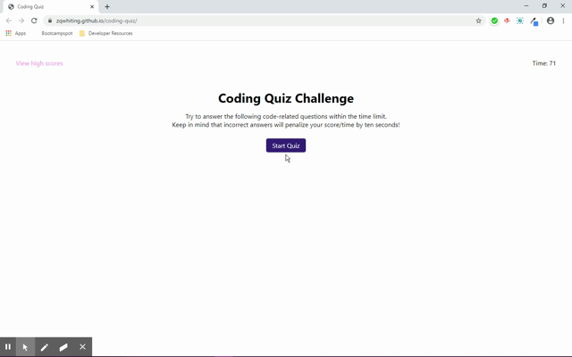

# Coding Quiz
This is a quiz game designed to score the player on how quickly and accurately they can answer multiple choice questions. The provided questions are computer code related, but can be adjusted in the `script.js` file for any amount or type of questions.

## Link
https://zqwhiting.github.io/coding-quiz/

## Usage
This program is run on an HTML webpage. To use this program, simply load the webpage and click the `Start Quiz` button. A timer will start counting down in the top right corner of the page, and questions will be rotated into the display with their four corresponding answer options each time an answer button is pressed, until there are no more questions or the timer runs out. Each answer answered incorrectly will penalize the user's remaining time to answer questions and lower their score. The user will then be asked to input their initials to save their score to the high score page.

## Additional Features
* High scores stored in local storage.
* A score and penalty system.

## Visual

## Roadmap
* All adjustable perameters could be stored in a separate file for user accessibility.
* Questions could be assigned randomly instead of the static order they have now.
* A growing question pool.
* Score based on how many questions are answered.
* Limit the high-score initial input to only accept three characters.
* Further css styling.

## Author
This program was developed solely by Z.Q.Whiting based off a prompt provided by the University of Utah online coding bootcamp.

## Tech Used
HTML, DOM, WebStorage, CSS, JavaScript. 
